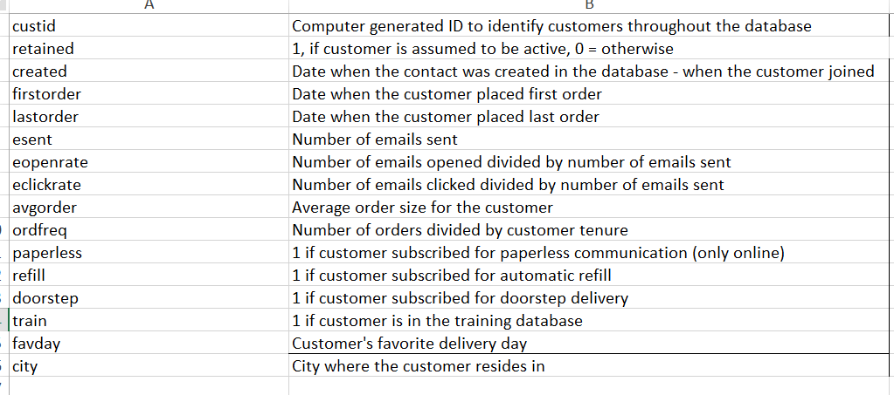
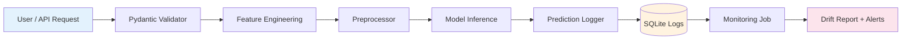
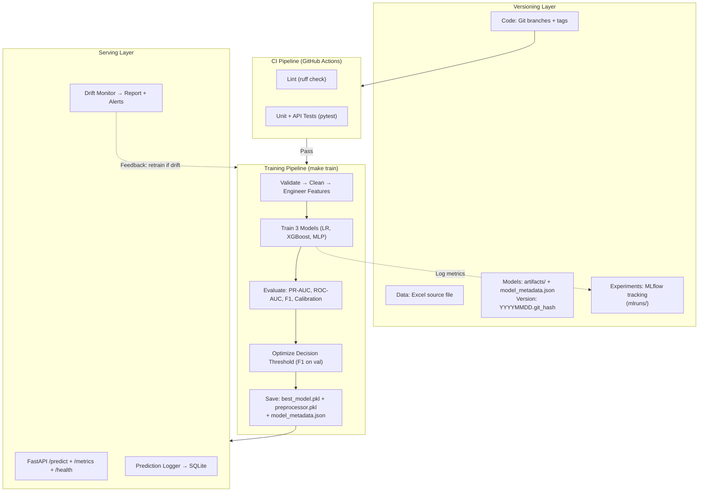

# Baubap Churn Prediction Challenge

End-to-end ML system for predicting customer churn, built as a senior ML/MLOps engineering challenge. Includes model training with experiment tracking, a FastAPI serving layer, prediction logging, and drift monitoring.
## Data Dictionary and Distribution
The distribution of scores are 20.5%/79.5%


## Project Structure

```
bb-tech-challenge/
├── src/
│   ├── config.py                 # Centralized configuration
│   ├── data/
│   │   ├── preprocessing.py      # Data cleaning, feature engineering, splitting
│   │   └── validation.py         # Schema and range validation
│   ├── models/
│   │   ├── train.py              # Multi-model training pipeline
│   │   └── evaluate.py           # Evaluation plots and metrics
│   ├── api/
│   │   └── app.py                # FastAPI prediction service
│   ├── prediction_logging/
│   │   ├── prediction_logger.py  # SQLite prediction logger
│   │   └── batch_inference.py    # Batch scoring with logging
│   ├── monitoring/
│   │   └── drift_monitor.py      # PSI, KS, Chi-square drift detection
│   └── utils/
│       └── artifacts.py          # Centralized artifact loading and versioning
├── tests/                        # Unit and API tests (36 tests)
├── notebooks/                    # EDA notebook
├── .github/workflows/ci.yml      # CI pipeline (lint + test)
├── Makefile                      # Pipeline commands
└── pyproject.toml                # Dependencies (managed with uv)
```

## Quick Start

```bash
# Install dependencies and create directories
make setup        # Runs uv sync + creates logs/, artifacts/, monitoring/, data/

# Run full pipeline
make train        # Train models (LR, XGBoost, MLP) with MLflow tracking
make evaluate     # Generate evaluation plots in artifacts/
make infer        # Run batch inference, log 200 predictions to SQLite
make monitor      # Generate drift report

# Serve API
make api          # Start FastAPI on http://localhost:8000

# Run tests
make test         # 36 unit + API tests
```

## API Usage

```bash
# Health check
curl http://localhost:8000/health

# Predict churn for a single user
curl -X POST http://localhost:8000/predict \
  -H "Content-Type: application/json" \
  -d '{
    "esent": 10, "eopenrate": 0.3, "eclickrate": 0.1,
    "avgorder": 50.0, "ordfreq": 5,
    "paperless": 1, "refill": 0, "doorstep": 1,
    "favday": "Mon", "city": "DEL",
    "created": "2023-01-01", "firstorder": "2023-01-10", "lastorder": "2023-06-01"
  }'

# Service metrics + latest drift report
curl http://localhost:8000/metrics
```

API docs available at `http://localhost:8000/docs` (Swagger UI).

## Architecture

### A) Logging & Monitoring Flow



**How it works:**
1. API receives raw user data (dates, categorical features, numeric features)
2. Pydantic validates the input schema, feature engineering computes temporal features using the persisted `ref_date`
3. The saved preprocessor transforms features identically to training
4. Model scores the user; prediction is logged to SQLite with `request_id`, `features_hash`, `score`, `latency_ms`, and `status`
5. A batch monitoring job reads logs + training data to compute drift metrics (PSI, KS, Chi-square) and generates a Markdown + JSON report with alert thresholds

### B) Versioning & CI/CD Pipeline



### Current Versioning Strategy

| Artifact | Versioning Method | Location |
|----------|------------------|----------|
| Code | Git (branches, tags, commits) | GitHub repo |
| Data | Source file tracked in repo | `data/raw/storedata_total.xlsx` |
| Models | Auto-version `YYYYMMDD.git_hash` | `artifacts/best_model.pkl` |
| Metadata | JSON with threshold, ref_date, version | `artifacts/model_metadata.json` |
| Experiments | MLflow run tracking | `mlruns/` |
| Predictions | SQLite with request_id, timestamp | `logs/predictions.db` |

### ML Pipeline

1. **Data**: Load Excel → validate schema → clean (drop null IDs, parse dates) → engineer temporal features → stratified split (70/15/15)
2. **Training**: Three model families (Logistic Regression, XGBoost, MLP) compared on PR-AUC. Best model selected, optimal threshold computed on validation set. All runs tracked in MLflow.
3. **Artifacts**: `best_model.pkl`, `preprocessor.pkl`, `model_metadata.json` (includes `ref_date`, threshold, version)

### Serving
- FastAPI with lifespan-managed state (no globals)
- Accepts raw user data (dates as ISO strings), computes features server-side using the persisted `ref_date`
- Predictions logged to SQLite with latency, features hash, and optional ground truth

### Monitoring
- **Data drift**: PSI + KS test (numeric), Chi-square (categorical)
- **Prediction drift**: Score distribution PSI + positive rate shift
- **Service metrics**: Error rate, latency percentiles (p50/p95/p99)

## EDA Conclusions

### Data Quality
- 30,781 valid records after dropping 20 rows with correlated null identifiers
- No duplicate customer IDs detected
- All numeric features have valid ranges, no significant outliers

### Target
- Moderate imbalance: 20.5% churn / 79.5% retained (4:1 ratio)
- Handled via class weights, not resampling
- Primary metric: PR-AUC (appropriate for class imbalance)

### Features
- Strongest raw predictors identified via Cohen's d analysis (> 0.8)
- Weak/noise features: Cohen's d < 0.5
- Zero-inflation detected in: esent, eopenrate, eclickrate, ordfreq

### Engineered Features
- `order_recency_ratio` is the strongest engineered feature
- Potential leakage concern:
  - If `retained=0` was labeled based on "no order in X days", then `order_recency_ratio` restates the label definition (leakage)
  - If `retained=0` was labeled by explicit account cancellation, then `order_recency_ratio` is a legitimate leading indicator. This interpretation is used in this challenge.
- `tenure_days` and `days_since_first_order` are correlated but retained because tree models handle this naturally

### Leakage Assessment
- `lastorder`-derived features partially encode the target -- documented and flagged for reviewer discussion
- Retained because they represent information available at prediction time in production

### Splitting Strategy
- Stratified random split (70/15/15) -- appropriate because features are aggregated snapshots, not time-series events
- Temporal split not required: no future-information leakage through features

## Key Design Decisions

| Decision | Rationale |
|----------|-----------|
| `from src.xxx` imports (no `sys.path` hacks) | Proper Python packaging, works from project root |
| `src/utils/artifacts.py` as single loader | Eliminates duplicated pickle.load across 4+ files |
| `get_churn_probability()` via `model.classes_` | Safe lookup instead of hardcoded `predict_proba[:, 0]` |
| `ref_date` persisted in metadata | Feature engineering reproducibility at inference time |
| FastAPI lifespan pattern | No global mutable state, clean startup/shutdown |
| Model version as `YYYYMMDD.git_hash` | Auto-generated, traceable, no manual bumping |
| Data validation in `prepare_data()` | Catches schema issues before they propagate |

## Production Roadmap

The following items are documented as production improvements beyond the scope of this dev challenge:

### ML Methodology
- **Hyperparameter tuning**: Bayesian optimization via Optuna with `--tune` flag, searching over model-specific parameter spaces, optimizing PR-AUC on validation set
- **Cross-validation**: 5-fold stratified CV on train+val after model selection to validate stability. Log `cv_pr_auc_mean` and `cv_pr_auc_std` to MLflow
- **Threshold-metric consistency**: Remove F1@0.5 from model comparison (misleading for imbalanced problems), compute `f1_at_optimal_threshold` instead
- **Calibration**: Wrap best model in `CalibratedClassifierCV(cv="prefit", method="isotonic")` fitted on validation set for reliable probability estimates
- **Model explainability (SHAP)**: Add TreeExplainer for global summary plots, per-prediction force plots, and `feature_importance.json` artifact

### Infrastructure
- **Prediction store**: Replace SQLite with PostgreSQL for concurrent API instances
- **Drift monitoring data source**: Save reference data as `artifacts/reference_data.parquet` during training, accept `--current-data-path` for genuine production data
- **Structured logging**: Replace `print()` with Python `logging` module (configurable levels, timestamps, module names)
- **Prometheus metrics**: Replace custom `/metrics` with `prometheus-fastapi-instrumentator` for standard RED metrics, Grafana dashboards, and latency SLO alerting
- **Data versioning (DVC)**: Track data files and artifacts alongside Git for exact reproducibility of any training run
- **Containerization**: Add Dockerfile (multi-stage build) and docker-compose for API, batch inference, and drift monitoring services. Deploy via Kubernetes or ECS with blue/green or canary strategy.

### MLOps
- **CI/CD pipeline**: Current CI runs lint + tests. Production pipeline: PR gate → training DAG → model validation gate → staging deploy → canary production deploy → post-deploy monitoring
- **Model registry**: Register models in MLflow Model Registry with stage transitions (Staging → Production) for version comparison, rollback, and approval workflows
- **Feature contract**: Unify API Pydantic schema and pipeline validation into a single source-of-truth contract
- **Linting**: Add `ruff` with `[tool.ruff]` config in `pyproject.toml`, enforce via CI and pre-commit hooks
- **Python packaging**: Add `[project.scripts]` entry points and `[tool.pytest.ini_options]` to `pyproject.toml`
- **Automatic retraining trigger**: Trigger retraining when PSI exceeds alert threshold for N consecutive runs. **Risks**: retraining on corrupted data amplifies errors; concept drift may require feature redesign, not just retraining; without a validation gate, retrained models could perform worse; runaway loops if drift is caused by pipeline bugs. **Recommendation**: semi-automated pipeline with drift-triggered retraining but validation gate (new PR-AUC > baseline) and optional human approval before production promotion
